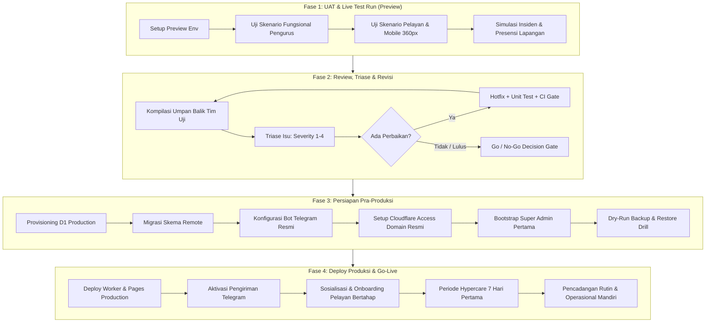

# Rencana Fase Deployment Sistem Pelayanan Ibadah (SPI)

**Versi:** 1.0  
**Tanggal:** 2026-09-11  
**Dasar Acuan:** [PRD Sistem Pelayanan Ibadah v1.2](file:///d:/Aplikasiku/SPI-SistemPelayananIbadah/PRD_Sistem_Pelayanan_Ibadah_v1.2.md), [AI_RULES_SPI.md](file:///d:/Aplikasiku/SPI-SistemPelayananIbadah/AI_RULES_SPI.md), dan [RUNBOOK.md](file:///d:/Aplikasiku/SPI-SistemPelayananIbadah/RUNBOOK.md)  
**Status Target:** Kesiapan Peluncuran Produksi (Free-Tier Edge Architecture Rp0)

---

## 1. Pendahuluan & Sasaran Rencana

Rencana deployment ini memetakan seluruh tahapan transisi sistem dari selesainya fase pengembangan (Build Fase 0 hingga Fase 5) menuju operasional pelayanan nyata gereja. Tujuannya adalah memastikan:

1. **Keandalan Pelayanan**: Aplikasi teruji secara fungsional dalam kondisi riil tanpa mengganggu jalannya ibadah mingguan.
2. **Kepatuhan Privasi & Etika Data**: Menjaga kerahasiaan catatan pastoral jemaat (RBAC-06), tidak adanya penilaian spiritual otomatis oleh AI, serta penerapan prinsip hak asasi data jemaat.
3. **Isolasi Lingkungan Ketat**: Pengujian nyata dilakukan pada lingkungan _Preview_ terisolasi dengan pengiriman Telegram dimatikan (`SPI_TELEGRAM_DELIVERY_ENABLED=false`), mencegah pesan uji terkirim ke jemaat umum.
4. **Disiplin Biaya Rp0**: Memaksimalkan arsitektur serverless Cloudflare Pages, Workers, D1 Database, dan Telegram Bot tanpa menimbulkan biaya tak terduga.

---

## 2. Peta Jalan Deployment (Deployment Roadmap)



---

## 3. Rincian Fase 1: Live Test Run & User Acceptance Testing (UAT)

UAT dijalankan pada lingkungan **Preview** Cloudflare Workers/Pages untuk memverifikasi fungsionalitas aplikasi di tangan pengguna nyata (pengurus, koordinator bidang, pelayan, dan sekretariat).

### 3.1 Prasyarat Lingkungan Preview

- Eksekusi konfigurasi preview otomatis:
  ```bash
  npm run setup:preview --apply
  ```
- **Kondisi Keamanan Wajib**:
  - `SPI_AUTH_MODE=preview_key` (otentikasi kunci acak terproteksi hash SHA-256 tanpa biaya Zero Trust berbayar).
  - `SPI_TELEGRAM_DELIVERY_ENABLED=false` (bot menerima webhook namun tidak mengirim pesan outbound nyata ke Telegram publik).
  - D1 database preview terpisah dari production (`spi-preview`).

### 3.2 Matriks Skenario Pengujian UAT

| ID Skenario | Peran Penguji                    | Alur Pengujian                                                                                                                                                                                                                                               | Kriteria Keberhasilan                                                                                                               |
| :---------- | :------------------------------- | :----------------------------------------------------------------------------------------------------------------------------------------------------------------------------------------------------------------------------------------------------------- | :---------------------------------------------------------------------------------------------------------------------------------- |
| **UAT-ADM** | Super Admin / Pengurus           | 1. Login menggunakan preview access key.<br>2. Setup profil organisasi jemaat.<br>3. Konfigurasi jadwal ibadah rutin mingguan.<br>4. Impor data penugasan via format Excel/CSV.                                                                              | Data tersimpan rapi, audit log mencatat aktivitas, tidak ada error format data.                                                     |
| **UAT-KOR** | Koordinator Bidang Musik/Liturgi | 1. Pemilihan pelayan ibadah (Worship Leader, Pemain Musik, Usher).<br>2. Simulasi pelayan berhalangan hadir mendadak.<br>3. Pemicu insiden & rekomendasi penggantian deterministik.<br>4. Penggunaan modal kontak darurat WhatsApp dengan pesan pra-isi.     | Pelayan pengganti terpilih tanpa ranking rohani, tautan WhatsApp otomatis terbuka dengan pesan sopan dan jelas.                     |
| **UAT-PEL** | Pelayan Ibadah (Uji)             | 1. Akses halaman jadwal pribadi pada ponsel (resolusi layar 360px - 412px).<br>2. Simulasi aktivasi bot Telegram di private chat.<br>3. Konfirmasi kesediaan tugas ibadah.<br>4. Penolakan tugas dengan alasan terstruktur.                                  | Antarmuka responsif tanpa horizontal scrolling, konfirmasi tercatat real-time di dasbor koordinator.                                |
| **UAT-SEK** | Sekretariat & Tim Pastoral       | 1. Pencatatan presensi kehadiran aktual saat ibadah berlangsung.<br>2. Input catatan pastoral jemaat yang membutuhkan dukungan doa.<br>3. Verifikasi proteksi akses catatan pastoral dari peran non-pastoral.<br>4. Unduh rekapitulasi kehadiran format CSV. | Catatan pastoral terenkripsi/terisolasi (hanya terbaca oleh Pastor/Admin), CSV bersih dari karakter berbahaya (CSV injection safe). |

---

## 4. Rincian Fase 2: Review, Triase Isu, dan Siklus Revisi

Setelah sesi live test run selesai, seluruh temuan dikompilasi untuk ditinjau bersama pemangku kepentingan pelayanan.

### 4.1 Kebijakan Klasifikasi Isu (Issue Triage)

1. **Severity 1 (Blocker - Penahan Rilis)**:
   - Kebocoran data jemaat atau catatan pastoral ke peran yang tidak berwenang.
   - Kegagalan transaksi basis data yang menyebabkan jadwal ibadah hilang.
   - Token bot atau kredensial tercetak pada log / respons antarmuka.
   - _Tindakan_: Perbaikan darurat wajib selesai sebelum masuk Fase 3.
2. **Severity 2 (Mayor - Hambatan Operasional)**:
   - Tampilan antarmuka rusak pada layar ponsel ukuran 360px sehingga tombol konfirmasi tidak dapat ditekan.
   - Gagal ekspor CSV atau data presensi terpotong.
   - _Tindakan_: Harus diselesaikan dan diverifikasi ulang dalam siklus revisi.
3. **Severity 3 (Minor - Ketidaknyamanan Tampilan)**:
   - Ketidaksesuaian tipografi, tata bahasa pesan notifikasi, atau keterlambatan animasi transisi.
   - _Tindakan_: Diperbaiki jika waktu mencukupi, atau dijadwalkan pada rilis minor berikutnya.
4. **Severity 4 (Usulan Fitur Baru)**:
   - Permintaan integrasi baru atau laporan analitik tambahan di luar cakupan PRD v1.2.
   - _Tindakan_: Dicatat dalam backlog pengembangan versi berikutnya.

### 4.2 Prosedur Siklus Perbaikan (Revision & Hotfix Cycle)

Setiap revisi wajib mengikuti disiplin rekayasa perangkat lunak ketat:

```bash
# 1. Pastikan perbaikan dilengkapi pengujian regresi
npm run test

# 2. Jalankan seluruh gerbang kualitas sebelum merge
npm run check
# (Memastikan format, linting, typecheck, unit test, dan dry-run build lulus 100%)
```

### 4.3 Gerbang Keputusan "Go / No-Go" (Quality Gates Checklist)

Sebelum melangkah ke tahap produksi, seluruh poin berikut wajib berstatus **LULUS**:

- [ ] 0 isu terbuka berstatus Severity 1 dan Severity 2.
- [ ] 100% tes otomatis lulus (`npm test` $\ge$ 169 tests lulus).
- [ ] `npm run security:secrets` menyatakan zero leaked tokens.
- [ ] Persetujuan formal dari Koordinator Ibadah dan Administrator Sistem.

---

## 5. Rincian Fase 3: Persiapan Pra-Produksi (Production Readiness)

Fase ini mempersiapkan lingkungan Cloudflare produksi resmi yang stabil dan aman.

### 5.1 Penyediaan Basis Data Cloudflare D1 Production

1. Pembuatan database produksi:
   ```bash
   npx wrangler d1 create spi-production
   ```
2. Menerapkan seluruh migrasi skema secara remote:
   ```bash
   npx wrangler d1 migrations apply spi-production --remote
   ```

### 5.2 Pengaturan Otentikasi Cloudflare Zero Trust Access

Untuk domain resmi gereja (misal `pelayanan.gereja.org`):

- Mode otentikasi produksi: `SPI_AUTH_MODE=cloudflare_access`.
- Pasang `SPI_ACCESS_ISSUER` (URL team Cloudflare Access).
- Pasang `SPI_ACCESS_AUDIENCE` (AUD tag aplikasi Access).
- Konfigurasi kebijakan Access berbasis One-Time Pin (OTP) email untuk pengurus dan pelayan terdaftar.

### 5.3 Registrasi Bot Telegram Resmi Produksi

1. Daftarkan bot resmi melalui `@BotFather` di Telegram (misal: `@SPIPelayananIbadahBot`).
2. Pasang token rahasia dan webhook HTTPS:
   ```bash
   # Pasang token bot ke Worker Secret produksi
   node scripts/configure-telegram-cloud.mjs production

   # Daftarkan webhook URL dengan secret acak >= 32 karakter
   node scripts/configure-telegram-webhook.mjs production
   ```
3. Set variabel Worker produksi: `SPI_TELEGRAM_DELIVERY_ENABLED=true`.

### 5.4 Inisialisasi Organisasi & Super Admin Pertama

Jalankan skrip bootstrap produksi untuk menetapkan akun administrator utama gereja:

```bash
export SPI_ENVIRONMENT=production
export CLOUDFLARE_ACCOUNT_ID="<account_id>"
export SPI_D1_DATABASE_ID="<production_d1_id>"
export CLOUDFLARE_API_TOKEN="<api_token>"
export SPI_BOOTSTRAP_ORGANIZATION_ID="org-jemaat-pusat"
export SPI_BOOTSTRAP_ORGANIZATION_NAME="Gereja Jemaat Pusat"
export SPI_BOOTSTRAP_TIMEZONE="Asia/Makassar"
export SPI_BOOTSTRAP_USER_ID="u-admin-utama"
export SPI_BOOTSTRAP_USER_NAME="Super Administrator"
export SPI_BOOTSTRAP_EMAIL="admin@gereja.invalid"

node scripts/bootstrap-cloud.mjs production --apply
```

### 5.5 Simulasi Pemulihan Bencana Pertama (Initial Restore Drill)

Jalankan uji cadangan dan pemulihan awal pada basis data kosong untuk memverifikasi kesiapan prosedur darurat:

```bash
node scripts/backup-d1.mjs --org org-jemaat-pusat --out backups/initial-baseline.json
node scripts/restore-d1.mjs --file backups/initial-baseline.json --org org-jemaat-pusat
```

---

## 6. Rincian Fase 4: Peluncuran Resmi (Go-Live & Hypercare)

### 6.1 Eksekusi Deployment Produksi

1. Deploy antarmuka frontend ke Cloudflare Pages:
   ```bash
   npm run build
   npx wrangler pages deploy dist/web --project-name spi-pages-production
   ```
2. Deploy backend ke Cloudflare Workers:
   ```bash
   node scripts/wrangler.mjs deploy --config apps/worker/wrangler.jsonc --env production
   ```

### 6.2 Onboarding Pelayan Bertahap (Phased Rollout)

Untuk meminimalkan kebingungan jemaat dan beban adaptasi:

- **Minggu ke-1**: Khusus Tim Inti Musik & Liturgi (5–10 orang) untuk pembiasaan konfirmasi via Telegram dan pengecekan jadwal.
- **Minggu ke-2**: Perluasan ke Tim Multimedia, Sound System, dan Usher.
- **Minggu ke-3**: Peluncuran penuh mencakup seluruh bidang pelayanan ibadah umum.

### 6.3 Periode Hypercare (7 Hari Pertama Pasca-Peluncuran)

1. **Pemantauan Harian (Daily Standup Monitoring)**:
   - Pemantauan metrik Workers di Cloudflare Dashboard (mengecek kuota 100.000 request/hari free-tier dan error rate 5xx).
   - Verifikasi tidak ada kegagalan pengiriman webhook Telegram (`audit_logs` kategori `telegram`).
2. **Dukungan Meja Bantuan Cepat**:
   - Sekretariat menyediakan kontak bantuan luring/WhatsApp bagi pelayan yang mengalami kendala otentikasi atau aktivasi akun bot.
3. **Pencadangan Data Rutin**:
   - Eksekusi pencadangan D1 perdana pasca-ibadah minggu pertama menggunakan `node scripts/backup-d1.mjs`.

---

## 7. Rencana Kontingensi & Rollback Darurat

Jika terjadi kendala kritis yang tidak dapat segera diatasi pada saat go-live:

1. **Fallback SOP Luring**:
   - Koordinator mengaktifkan SOP Luring (lembar cetak rekapitulasi jadwal fisik dan koordinasi grup WhatsApp darurat yang telah diunduh sebelum hari H).
2. **Rollback Deployment Frontend**:
   - Melalui dasbor Cloudflare Pages, lakukan pengalihan instan (_instant rollback_) ke deployment versi stabil sebelumnya hanya dengan satu klik.
3. **Isolasi Bot Telegram**:
   - Jika webhook mengalami kendala atau membanjiri request, nonaktifkan sementara pengiriman pesan dengan mengubah variabel worker `SPI_TELEGRAM_DELIVERY_ENABLED=false` tanpa perlu mematikan aplikasi web utama.
